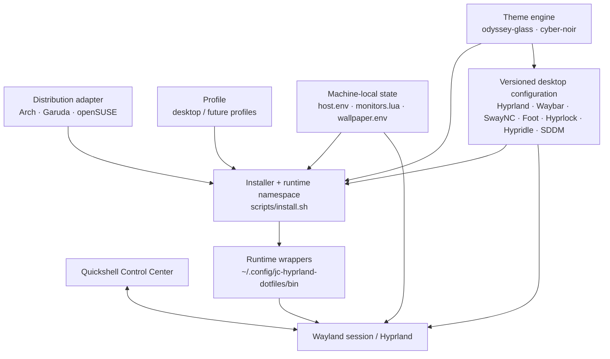
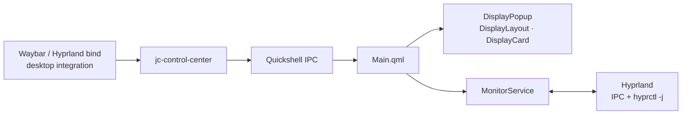
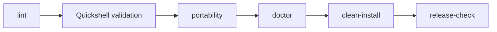

<p align="center">
  <a href="https://hypr.land/">
    
  </a>
</p>

<h1 align="center">jc-hyprland-dotfiles</h1>

<p align="center">
  <strong>A modular, theme-driven, multi-monitor and distro-aware Hyprland desktop environment.</strong>
</p>

<p align="center">
  Reproducible where it should be · machine-local where it must be · safe to evolve
</p>

<p align="center">
  
  
  
  
</p>

<p align="center">
  <a href="https://garudalinux.org/">
    
  </a>
  &nbsp;&nbsp;&nbsp;&nbsp;
  <a href="https://archlinux.org/">
    
  </a>
  &nbsp;&nbsp;&nbsp;&nbsp;
  <a href="https://www.opensuse.org/">
    
  </a>
</p>

<p align="center">
  <strong>Garuda Linux</strong> · <strong>Arch Linux</strong> · <strong>openSUSE Tumbleweed</strong>
</p>

<p align="center">
  <a href="#architecture">Architecture</a> ·
  <a href="#quickshell-control-center">Control Center</a> ·
  <a href="#themes">Themes</a> ·
  <a href="#installation">Installation</a> ·
  <a href="#quality-gates">Quality</a> ·
  <a href="#roadmap">Roadmap</a>
</p>

---

> **Development status**
>
> `v0.1.0` is an early but functional development release. Garuda Linux with
> Hyprland 0.56.2 is the primary validated environment today. The supported
> Hyprland configuration path is Lua-only; Arch Linux and openSUSE adapters are
> present in the repository and remain targets for full clean-install validation.

## Why this project exists

`jc-hyprland-dotfiles` is not intended to be a monolithic “rice” copied into a
single machine. The project separates reusable desktop configuration from
distribution-specific package management, machine-specific hardware data,
runtime integration and visual themes.

The result is a Hyprland environment that can evolve without embedding monitor
serials, PCI addresses, user paths or distribution assumptions into shared
configuration.

### Design principles

- **Modular** — compositor, services, UI, themes and runtime helpers are separate.
- **Distro-aware** — package and integration differences live below `distros/`.
- **Hardware-aware, not hardware-bound** — host values remain outside Git.
- **Multi-monitor first** — monitor roles and topology are part of the design.
- **Theme-driven** — consumers read a shared active-theme contract.
- **Runtime-decoupled** — wrappers hide implementation details from Waybar/binds.
- **Reversible** — installation favors symlinks, generated bridges and local state.
- **Quality-gated** — lint, portability, doctor, clean-install and release checks.
- **Lua-native** — Hyprland configuration targets the Lua model used by Hyprland 0.55+.

---

## Distribution targets

| Distribution | Status | Integration |
|---|---|---|
| **Garuda Linux** | ✅ Tested / primary development host | Arch-compatible packages + Garuda integration |
| **Arch Linux** | 🟡 Adapter available | `pacman` package adapter; clean-install validation pending |
| **openSUSE Tumbleweed** | 🟡 Adapter available | `zypper` package adapter; clean-install validation pending |

Distribution-specific logic is intentionally kept outside the common desktop
configuration.

```text
distros/
├── arch/
├── garuda/
└── opensuse/
```

---

## Desktop stack

| Layer | Components | Role |
|---|---|---|
| **Compositor** | Hyprland | Windows, workspaces, monitors, animations, rules |
| **Control Center** | Quickshell | Custom visual controls and Hyprland-aware widgets |
| **Status bars** | Waybar | Independent main and secondary monitor bars |
| **Notifications** | SwayNC | Notification daemon and notification center |
| **Launcher** | Wofi | Application launcher |
| **Terminal** | Foot | Theme-aware terminal |
| **Lock / idle** | Hyprlock + Hypridle | Lock screen and idle lifecycle |
| **Wallpaper** | Awww | Preferred wallpaper runtime and transitions |
| **Wallpaper fallback** | Hyprpaper | Fallback backend when available |
| **Login** | SDDM | Theme-aware login screen |
| **Automation** | Bash + systemd user units | Installation, runtime and wallpaper rotation |

---

# Architecture

The repository follows a layered model. Distribution and host concerns stay at
the outside; common desktop configuration and themes remain reusable.



### Configuration boundaries

```text
Versioned in Git
│
├── config/                  reusable component configuration
├── distros/                 distro-specific package/integration adapters
├── profiles/                reusable machine roles
├── scripts/                 installer, validation and runtime implementation
└── themes/                  visual/theme contracts

Machine-local
│
└── ~/.config/jc-hyprland-dotfiles/local/
    ├── host.env
    ├── monitors.lua
    └── wallpaper.env
```

Machine-specific values are intentionally excluded from the repository.

---

# Quickshell Control Center

Quickshell is being introduced as the visual control plane for desktop settings.
The implementation deliberately keeps UI, observed state, runtime commands and
persistent configuration separate.

## Phase 1A — display foundation

Current status:

```text
✓ Named Quickshell configuration: jc-hyprland
✓ Stable ShellId
✓ IPC controlCenter contract
✓ Monitor discovery through Hyprland
✓ Dynamic availableModes discovery
✓ Read-only monitor topology
✓ Display cards
✓ Runtime launcher
✓ jc-control-center wrapper
✓ Static Quickshell validation
✓ Installer / doctor / quality-gate integration
```

Phase 1A is intentionally **read-only**.



The UI never runs monitor commands directly. `MonitorService` owns observed
monitor state; future editing will use a draft model and a dedicated apply
service.

### Display implementation status

```text
Phase 1A    Read-only discovery                              ✓
Phase 1B.1  Draft editing                                    ✓
Phase 1B.2  Resolution / refresh runtime apply               ✓
Phase 1B.3  Safe Apply / Keep / automatic rollback           ✓
Phase 1B.4  Scale / orientation                              ✓
Phase 1B.5  Visual topology / position editor                ✓
Phase 1B.6  Safe monitor Enable / Disable                    ✓
Phase 1C.1  Atomic persistent monitors.lua integration       ✓
Phase 1C.2  Remove deprecated Hyprlang compatibility path    ✓
Phase 1C.3  Save Configuration UI orchestration              ✓
Phase 1D.1  Quickshell startup / lifecycle                     ✓
Phase 1D.2  Hyprland SUPER+C keybind                           ✓
Phase 1D.3  Waybar output-aware integration                    ✓
Phase 1D.4  Quality gates / documentation                      ✓
```

Display state deliberately remains separated into four layers:

```text
Observed State
      ↓
Draft State
      ↓
Applied Runtime State
      ↓
Persistent State (local/monitors.lua)
```

Runtime mutations are owned by `jc-displayctl`. Persistent display state is
owned by `jc-displaycfg`, which performs preview, backup, atomic replacement,
Hyprland reload, post-reload verification and automatic restoration on
validation failure.

---

# Themes

Two themes are currently included.

## Odyssey Glass

The primary desktop theme.

- dark glass surfaces
- blue / violet accents
- soft transparency
- rounded capsules
- moderate blur
- restrained animations

## Cyber Noir

Alternative high-contrast theme.

- near-black surfaces
- cyan / magenta accents
- stronger contrast
- neon-inspired palette

### Theme contract

```text
themes/<theme>/
├── theme.env
├── colors.conf
├── colors.css
├── colors.lua
├── foot-colors.ini
├── hyprlock.env
├── sddm.env
└── wallpapers/
    ├── main.webp
    └── secondary.webp
```

The active theme is exposed through:

```text
~/.config/jc-hyprland-dotfiles/theme
```

which points to the selected theme directory.

| Theme file | Consumer |
|---|---|
| `colors.lua` | Hyprland Lua configuration |
| `colors.conf` | Legacy palette export; not consumed by the supported Hyprland runtime |
| `colors.css` | Waybar, Wofi, SwayNC |
| `foot-colors.ini` | Foot |
| `hyprlock.env` | Hyprlock |
| `sddm.env` | SDDM |
| `theme.env` | Theme metadata and wallpaper configuration |

Useful commands:

```bash
make theme-list
make theme-current
make theme-apply THEME=odyssey-glass
make theme-apply THEME=cyber-noir
```

---

# Screenshots

> 📸 **Screenshots are pending while the desktop UI and Quickshell Control Center
> continue evolving.**
>
> This section intentionally avoids broken image links until the captures are
> ready.

Planned assets:

| View | Planned file |
|---|---|
| Odyssey Glass desktop | `docs/screenshots/odyssey-glass-desktop.webp` |
| Odyssey Glass launcher | `docs/screenshots/odyssey-glass-wofi.webp` |
| Odyssey Glass notifications | `docs/screenshots/odyssey-glass-swaync.webp` |
| Quickshell displays popup | `docs/screenshots/quickshell-displays.webp` |
| Odyssey Glass SDDM | `docs/screenshots/odyssey-glass-sddm.webp` |
| Cyber Noir desktop | `docs/screenshots/cyber-noir-desktop.webp` |

When those files exist, this section can be converted into a visual gallery
without changing the rest of the documentation.

---

# Multi-monitor model

The project does not embed connector names in themes. Hardware outputs receive
logical roles through machine-local configuration.

```ini
MAIN_OUTPUT=DP-3
SECONDARY_OUTPUT=DP-1

MAIN_WORKSPACES=1,2,3,4,5
SECONDARY_WORKSPACES=6,7,8,9,10
```

Real values belong in:

```text
~/.config/jc-hyprland-dotfiles/local/host.env
```

The Quickshell monitor service separately discovers live topology and modes from
Hyprland, allowing the UI to reflect the actual connected hardware instead of
using hardcoded resolution lists.

---

# Wallpaper lifecycle

Wallpaper configuration is theme-driven but machine-local overrides remain
possible.

```text
Theme
  │
  ├── wallpapers/main.webp
  └── wallpapers/secondary.webp
          │
          ▼
wallpaper-manager.sh
          │
          ├── Awww             preferred
          └── Hyprpaper        fallback
```

Automatic rotation is managed with user-level systemd units:

```text
config/systemd/user/
├── jc-wallpaper-rotation.service
└── jc-wallpaper-rotation.timer
```

Machine-local rotation settings remain outside Git in:

```text
~/.config/jc-hyprland-dotfiles/local/wallpaper.env
```

---

# Installation

Clone the repository:

```bash
git clone <repository-url>
cd jc-hyprland-dotfiles
```

Inspect the installation plan:

```bash
make dry-run
```

Run diagnostics:

```bash
make doctor
```

Install runtime links and local configuration:

```bash
make install
```

Review machine-specific state:

```text
~/.config/jc-hyprland-dotfiles/local/host.env
~/.config/jc-hyprland-dotfiles/local/monitors.lua
~/.config/jc-hyprland-dotfiles/local/wallpaper.env
```

Then enable the Hyprland integration when ready:

```bash
make apply
```

The installer favors managed symlinks and refuses to silently replace unrelated
non-symlink configuration.

---

# Runtime namespace

The repository checkout is not used directly by desktop consumers. The installer
exposes a stable runtime namespace.

```text
~/.config/jc-hyprland-dotfiles/
├── repo -> /path/to/jc-hyprland-dotfiles
├── theme -> /path/to/repo/themes/<active-theme>
│
├── bin/
│   ├── amd-gpu.sh
│   ├── apply-wallpaper.sh
│   ├── jc-control-center
│   ├── jc-displaycfg
│   ├── jc-displayctl
│   ├── jc-theme
│   ├── launch-foot.sh
│   ├── launch-wofi.sh
│   ├── lock-session.sh
│   ├── network-traffic.sh
│   ├── rotate-wallpaper.sh
│   ├── start-quickshell.sh
│   ├── start-swaync.sh
│   ├── start-waybar.sh
│   ├── suspend-session.sh
│   └── wallpaper-manager.sh
│
└── local/
    ├── host.env
    ├── monitors.lua
    ├── backups/
    │   └── displays/
    └── wallpaper.env
```

Quickshell itself is installed as a named configuration:

```text
~/.config/quickshell/jc-hyprland
    -> <repo>/config/quickshell/jc-hyprland
```

---

# Quality gates

The project treats desktop configuration as code.



Full validation:

```bash
make check
```

Focused validation:

```bash
make lint
make doctor
make quickshell-validate
make portability-check
make install-check
make clean-install-check
```

Runtime Quickshell IPC smoke test:

```bash
make quickshell-test
```

Release readiness:

```bash
make release-check
```

Current gates cover:

```text
Bash syntax
ShellCheck
Fish syntax
JSON / JSONC templates
Theme structure
Quickshell structure + display runtime/persistence safety contracts
Machine-specific hardcode detection
Hyprland config errors
Runtime dependency checks
Runtime symlink integrity
Wallpaper lifecycle
Notification daemon conflicts
Clean-install dry-run planning
Git whitespace validation
Release working-tree validation
```

---

# Hyprland Lua configuration

The supported compositor configuration path is now **Lua-only**.

The currently validated runtime is **Hyprland 0.56.2**. Hyprland deprecated
Hyprlang in 0.55 in favor of Lua, so this project no longer treats the old
Hyprlang configuration tree as an active compatibility path.

```text
~/.config/hypr/hyprland.lua
        │
        └── require("jc-dotfiles/init")
                         │
                         ├── theme.lua
                         ├── appearance.lua
                         ├── gaming.lua
                         ├── animations.lua
                         ├── autostart.lua
                         ├── local/monitors.lua
                         └── keybindings.lua
```

The project overlay is intentionally loaded after the distro-provided base
configuration so repository-managed and machine-local settings can override
the base without maintaining a fork of the entire distro configuration.

Machine-specific display state has one authoritative persistent source:

```text
~/.config/jc-hyprland-dotfiles/local/monitors.lua
```

Both display backends consume that same file:

```text
local/monitors.lua
      │
      ├── jc-displayctl   runtime mutation / Safe Apply / rollback
      └── jc-displaycfg   preview / backup / atomic persistence / restore
```

The former `monitors.conf`, `jc-dotfiles.conf` and pre-Lua configuration tree
were retired after the Lua persistence path was validated end-to-end. Current
installations must use the Lua integration exclusively.

Official Hyprland configuration reference:

- https://wiki.hypr.land/Configuring/Start/
- https://wiki.hypr.land/Configuring/Basics/Monitors/

---

# Repository structure

<details>
<summary><strong>Show current repository tree</strong></summary>

```text
.
├── CHANGELOG.md
├── config
│   ├── foot
│   │   └── foot.ini
│   ├── hypr
│   │   └── lua
│   │       ├── animations.lua
│   │       ├── appearance.lua
│   │       ├── autostart.lua
│   │       ├── gaming.lua
│   │       ├── init.lua
│   │       ├── keybindings.lua
│   │       ├── README.md
│   │       └── theme.lua
│   ├── hypridle
│   │   └── hypridle.conf.template
│   ├── hyprlock
│   │   ├── hyprlock.conf.template
│   │   └── README.md
│   ├── quickshell
│   │   └── jc-hyprland
│   │       ├── components
│   │       │   ├── JcButton.qml
│   │       │   └── JcCard.qml
│   │       ├── Main.qml
│   │       ├── modules
│   │       │   └── displays
│   │       │       ├── DisplayCard.qml
│   │       │       ├── DisplayLayout.qml
│   │       │       ├── DisplayLayoutEditor.qml
│   │       │       └── DisplayPopup.qml
│   │       ├── README.md
│   │       ├── services
│   │       │   ├── DisplayDraftStore.qml
│   │       │   ├── MonitorApplyService.qml
│   │       │   ├── MonitorModeParser.qml
│   │       │   └── MonitorService.qml
│   │       ├── shell.qml
│   │       └── theme
│   │           └── Theme.qml
│   ├── sddm
│   │   └── jc-hyprland
│   │       ├── components
│   │       │   ├── CyberNoir.qml
│   │       │   └── OdysseyGlass.qml
│   │       ├── Main.qml
│   │       ├── metadata.desktop
│   │       └── theme.conf
│   ├── swaync
│   │   ├── config.json.template
│   │   ├── README.md
│   │   └── style.css
│   ├── systemd
│   │   └── user
│   │       ├── jc-wallpaper-rotation.service
│   │       └── jc-wallpaper-rotation.timer
│   ├── waybar
│   │   ├── style.css
│   │   └── templates
│   │       ├── config-main.jsonc
│   │       └── config-secondary.jsonc
│   └── wofi
│       ├── config
│       └── style.css
├── distros
│   ├── arch
│   │   ├── install-packages.sh
│   │   └── packages.txt
│   ├── garuda
│   │   ├── integration.sh
│   │   └── README.md
│   └── opensuse
│       ├── install-packages.sh
│       └── packages.txt
├── docs
│   ├── architecture.md
│   ├── multi-monitor.md
│   └── screenshots
├── hosts
│   └── example
│       ├── host.env
│       ├── monitors.lua
│       └── wallpaper.env
├── install.sh
├── LICENSE
├── Makefile
├── PHASE-1A-AUTOMATION.md
├── profiles
│   └── desktop
│       └── profile.env
├── README.md
├── scripts
│   ├── backup.sh
│   ├── clean-install-check.sh
│   ├── configure-hypridle.sh
│   ├── configure-nwgbar.sh
│   ├── configure-sddm.sh
│   ├── configure-wallpaper-rotation.sh
│   ├── detect-distro.sh
│   ├── doctor.sh
│   ├── install.sh
│   ├── lib
│   │   └── common.sh
│   ├── lint.sh
│   ├── portability-check.sh
│   ├── release-check.sh
│   ├── runtime
│   │   ├── amd-gpu.sh
│   │   ├── apply-wallpaper.sh
│   │   ├── jc-control-center.sh
│   │   ├── jc-displaycfg.sh
│   │   ├── jc-displayctl.sh
│   │   ├── launch-foot.sh
│   │   ├── launch-wofi.sh
│   │   ├── lock-session.sh
│   │   ├── network-traffic.sh
│   │   ├── prepare-sddm-theme.sh
│   │   ├── rotate-wallpaper.sh
│   │   ├── select-theme.sh
│   │   ├── select-wallpaper.sh
│   │   ├── start-quickshell.sh
│   │   ├── start-swaync.sh
│   │   ├── start-waybar.sh
│   │   ├── suspend-session.sh
│   │   └── wallpaper-manager.sh
│   ├── show-structure.sh
│   ├── system
│   │   └── jc-hyprland-sddm-switch
│   ├── theme.sh
│   ├── validate-jsonc.py
│   ├── validate-quickshell.sh
│   └── validate-themes.sh
├── themes
│   ├── cyber-noir
│   │   ├── colors.conf
│   │   ├── colors.css
│   │   ├── colors.lua
│   │   ├── foot-colors.ini
│   │   ├── hyprlock.env
│   │   ├── sddm.env
│   │   ├── theme.env
│   │   └── wallpapers
│   │       ├── main.webp
│   │       └── secondary.webp
│   └── odyssey-glass
│       ├── colors.conf
│       ├── colors.css
│       ├── colors.lua
│       ├── foot-colors.ini
│       ├── hyprlock.env
│       ├── sddm.env
│       ├── theme.env
│       └── wallpapers
│           ├── main.webp
│           └── secondary.webp
├── uninstall.sh
├── update.sh
└── VERSION
```

</details>

---

# Useful commands

```bash
make help

# Validation
make lint
make doctor
make check
make quickshell-validate
make quickshell-test
make portability-check
make clean-install-check
make release-check

# Install / integration
make dry-run
make install
make apply

# Display persistence
~/.config/jc-hyprland-dotfiles/bin/jc-displaycfg status
~/.config/jc-hyprland-dotfiles/bin/jc-displaycfg preview
~/.config/jc-hyprland-dotfiles/bin/jc-displaycfg backups

# Themes
make theme-list
make theme-current
make theme-apply THEME=odyssey-glass

# Waybar
make waybar-test
make waybar-stop
make waybar-replace

# Wallpaper
make wallpaper-apply
```

---

# Roadmap

### Near term

- [x] Modular Hyprland foundation
- [x] Dual Waybar runtime
- [x] Theme engine
- [x] SwayNC integration
- [x] Hyprlock / Hypridle integration
- [x] Awww wallpaper management
- [x] Wallpaper rotation timer
- [x] SDDM theme foundation
- [x] Quickshell Control Center Phase 1A
- [x] Quickshell quality-gate integration
- [x] Quickshell display editing draft model
- [x] Resolution / refresh selectors
- [x] Scale / orientation controls
- [x] Visual monitor topology editor
- [x] Safe runtime apply / Keep / rollback
- [x] Safe monitor Enable / Disable
- [x] Atomic persistent monitor configuration in `local/monitors.lua`
- [x] Waybar hotplug behavior validated with monitor Enable / Disable
- [x] Quickshell startup integrated with Hyprland session
- [x] `SUPER + C` Control Center keybind
- [x] Output-aware Control Center buttons in MAIN / SECONDARY Waybar
- [x] Remove deprecated Hyprlang repository/runtime artifacts
- [x] Connect global `Save Configuration` action to the Control Center UI
- [ ] Repository screenshots

### Portability

- [x] Garuda Linux validation
- [ ] Arch Linux clean-install validation
- [ ] openSUSE Tumbleweed clean-install validation

### Later

- [ ] Additional desktop/laptop profiles
- [ ] Additional themes
- [ ] VRR controls
- [ ] HDR / 10-bit display controls where supported
- [ ] Extended visual settings modules
- [ ] Stronger automated rollback and recovery

---

# Safety

The project intentionally avoids blindly overwriting user configuration.

Machine-local state is kept outside Git. Hyprland consumes the repository Lua
overlay plus machine-local `monitors.lua`; runtime wrappers keep mutable display
operations behind validated service boundaries, and installation uses safe
symlink checks.

Before applying changes:

```bash
make dry-run
make check
```

Before publishing a release:

```bash
make release-check
```

---

# Documentation

Additional documentation lives under:

```text
docs/
├── architecture.md
├── multi-monitor.md
└── screenshots/
```

The README provides the high-level map; component-specific details should remain
close to their implementation.

---

# License

This project is licensed under the **MIT License**. See [LICENSE](LICENSE).

---

<p align="center">
  <sub>
    Hyprland, Garuda Linux, Arch Linux and openSUSE names and marks belong to
    their respective projects/owners. This repository is an independent
    configuration project and is not affiliated with or endorsed by them.
  </sub>
</p>
