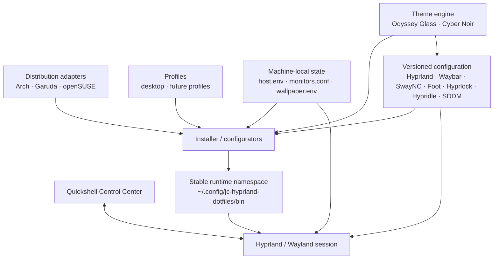
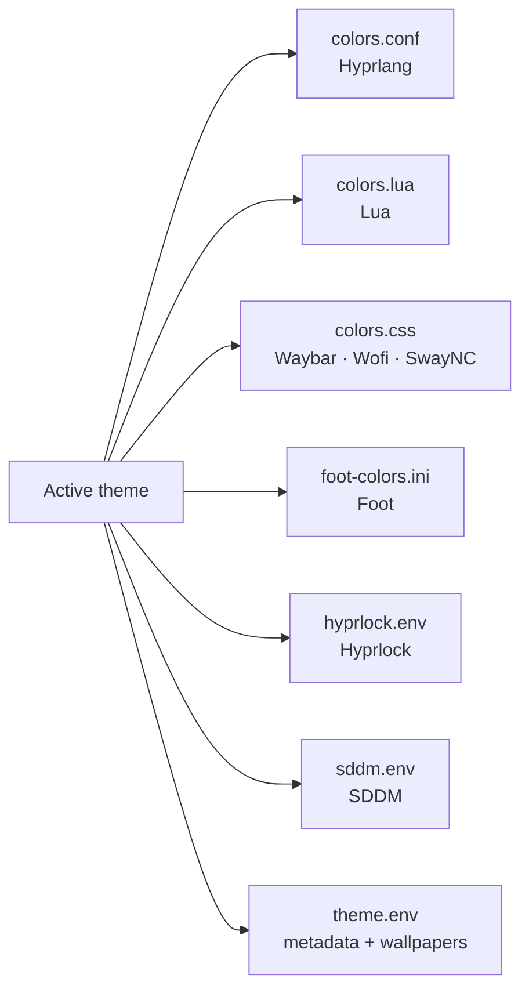
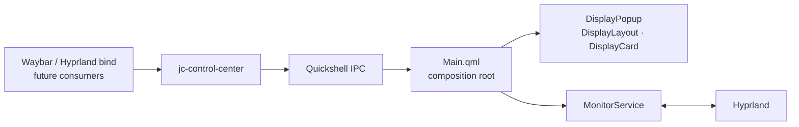
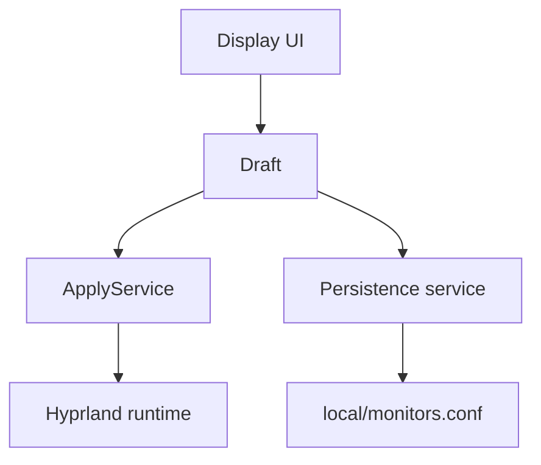
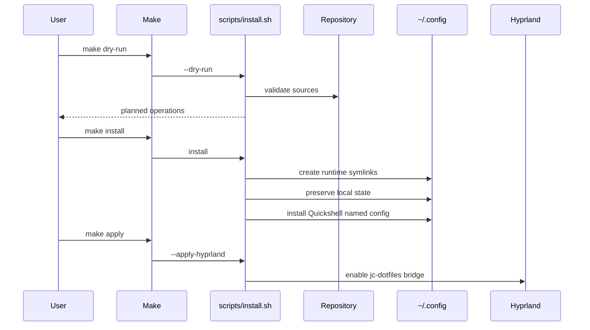

# Arquitectura

`jc-hyprland-dotfiles` está diseñado como un entorno Hyprland **modular, portable,
theme-driven y consciente del hardware**, evitando convertir toda la configuración
del escritorio en un único bloque acoplado a una distribución o máquina.

La arquitectura separa deliberadamente:

- configuración reutilizable,
- adaptadores de distribución,
- estado local de la máquina,
- runtime,
- temas,
- UI/Control Center,
- automatización y quality gates.

---

## Objetivos de arquitectura

Los principios principales son:

1. **Separación de responsabilidades**  
   Cada capa debe tener una responsabilidad clara y mínima.

2. **Portabilidad entre distribuciones**  
   Las diferencias de Arch, Garuda y openSUSE viven fuera de la configuración
   común del escritorio.

3. **Portabilidad entre máquinas**  
   Monitores, GPU, wallpapers locales y otros datos del host no deben quedar
   hardcodeados en Git.

4. **Runtime desacoplado**  
   Waybar, binds y otros consumidores no deben conocer detalles internos de
   implementación cuando existe un wrapper estable.

5. **Temas como contrato visual**  
   Los componentes consumen formatos específicos del tema activo sin conocer
   directamente qué tema fue seleccionado.

6. **Configuración segura y reversible**  
   La instalación favorece symlinks, bridges y archivos locales preservados.

7. **Evolución incremental**  
   Nuevas capacidades —como Quickshell— se agregan como módulos y servicios,
   no como lógica insertada directamente en componentes existentes.

---

# Vista general



La idea central es que **ninguna capa inferior deba conocer innecesariamente
detalles de una capa superior**.

---

# Capas del proyecto

## 1. Distribución

Ruta:

```text
distros/
├── arch/
├── garuda/
└── opensuse/
```

Responsabilidad:

- paquetes,
- diferencias de package manager,
- integración específica de la distribución,
- preparación de dependencias.

No debe contener:

- configuración de monitores,
- temas,
- reglas Waybar,
- estado local del usuario.

La configuración común del escritorio debe seguir funcionando sin conocer qué
adaptador de distribución la instaló.

---

## 2. Perfiles

Ruta:

```text
profiles/
└── desktop/
    └── profile.env
```

Responsabilidad:

- definir el tipo lógico de estación,
- habilitar módulos o políticas de escritorio,
- servir como futura frontera para perfiles como:
  - desktop,
  - laptop,
  - workstation,
  - gaming,
  - minimal.

Un perfil no debe almacenar datos físicos de una máquina concreta.

---

## 3. Configuración reutilizable

Ruta principal:

```text
config/
```

Contiene configuración compartida de:

```text
foot
hypr
hypridle
hyprlock
quickshell
sddm
swaync
systemd
waybar
wofi
```

Regla:

> `config/` no debe contener identidad de máquina, seriales de monitor,
> direcciones PCI personales ni rutas absolutas de usuario.

Esta regla permite que el mismo checkout pueda reutilizarse en diferentes hosts.

---

## 4. Estado machine-local

El estado físico y personal vive fuera del checkout:

```text
~/.config/jc-hyprland-dotfiles/local/
├── host.env
├── monitors.conf
└── wallpaper.env
```

### `host.env`

Responsabilidad:

- roles de monitor,
- workspaces por rol,
- perfil,
- hardware opcional.

### `monitors.conf`

Responsabilidad:

- configuración persistente de monitores del host.

### `wallpaper.env`

Responsabilidad:

- overrides locales,
- rotación,
- intervalos,
- target de wallpaper.

Estos archivos se preservan durante reinstalaciones y actualizaciones.

---

# Runtime namespace

El checkout del repositorio no debe convertirse en una API implícita para todos
los consumidores.

El instalador expone un namespace estable:

```text
~/.config/jc-hyprland-dotfiles/
├── repo -> /path/to/jc-hyprland-dotfiles
├── theme -> /path/to/repo/themes/<active-theme>
│
├── bin/
│   ├── amd-gpu.sh
│   ├── apply-wallpaper.sh
│   ├── jc-control-center
│   ├── jc-theme
│   ├── launch-foot.sh
│   ├── launch-wofi.sh
│   ├── lock-session.sh
│   ├── network-traffic.sh
│   ├── rotate-wallpaper.sh
│   ├── start-quickshell.sh
│   ├── start-swaync.sh
│   ├── start-waybar.sh
│   ├── suspend-session.sh
│   └── wallpaper-manager.sh
│
└── local/
    ├── host.env
    ├── monitors.conf
    └── wallpaper.env
```

Esto permite que consumidores externos usen:

```text
jc-control-center toggle
```

en lugar de conocer directamente:

```text
qs -c jc-hyprland ipc call controlCenter toggleDisplays
```

El wrapper funciona como una pequeña API de runtime.

---

# Arquitectura de temas

Ruta:

```text
themes/
├── cyber-noir/
└── odyssey-glass/
```

Cada tema implementa un contrato común:

```text
theme.env
colors.conf
colors.css
colors.lua
foot-colors.ini
hyprlock.env
sddm.env
wallpapers/
```

El tema activo se expone mediante:

```text
~/.config/jc-hyprland-dotfiles/theme
```

Los consumidores no deben necesitar saber si el tema actual es `odyssey-glass`,
`cyber-noir` u otro futuro.



---

# Arquitectura de Hyprland

La generación actualmente validada utiliza Hyprlang para Hyprland `0.54.x`.

```text
config/hypr/
├── hyprlang/
│   ├── common/
│   │   ├── animations.conf
│   │   ├── appearance.conf
│   │   ├── autostart.conf
│   │   ├── gaming.conf
│   │   ├── keybindings.conf
│   │   └── windowrules.conf
│   │
│   └── templates/
│       └── jc-dotfiles.conf.template
│
└── lua/
    ├── animations.lua
    ├── appearance.lua
    ├── autostart.lua
    ├── init.lua
    ├── keybindings.lua
    └── theme.lua
```

La separación es intencional:

```text
Hyprland config generation
          │
          ├── hyprlang/    estable / activa
          └── lua/         frontera de migración
```

Temas, profiles, runtime wrappers, distro adapters y estado local **no deben
depender del lenguaje de configuración de Hyprland**.

---

# Quickshell Control Center

Quickshell introduce una nueva capa visual de control, pero no reemplaza la
separación existente.

Ruta:

```text
config/quickshell/jc-hyprland/
├── shell.qml
├── Main.qml
├── components/
├── modules/
├── services/
└── theme/
```

Arquitectura actual:



## Responsabilidades

### `shell.qml`

Solo:

- define el `ShellId`,
- instancia la composición principal.

No debe contener lógica de monitor.

### `Main.qml`

Responsabilidad:

- composición,
- visibilidad,
- screen target,
- IPC.

No debe consultar directamente `hyprctl`.

### `MonitorService.qml`

Responsabilidad:

- estado observado de monitores,
- normalización de datos,
- integración Hyprland/`hyprctl`,
- `availableModes`.

No debe decidir colores ni layout visual.

### `modules/displays/*`

Responsabilidad:

- representación,
- interacción visual,
- composición de controles.

No debe ejecutar directamente comandos de configuración.

---

# Estado observado, draft y aplicado

La evolución del Control Center seguirá tres estados separados:

```text
Observed State
      │
      ▼
   Draft State
      │
      ▼
 Applied State
```

## Observed State

Lo que Hyprland está ejecutando actualmente.

Responsable:

```text
MonitorService
```

## Draft State

Cambios seleccionados por el usuario todavía no aplicados.

Responsable futuro:

```text
DisplayDraftStore
```

## Applied State

Resultado después de validar y enviar cambios al compositor.

Responsable futuro:

```text
ApplyService
```

Esta separación permite:

- Cancel,
- dirty tracking,
- preview,
- validación,
- rollback,
- persistencia independiente.

---

# Runtime vs persistencia

Modificar el runtime y guardar configuración persistente son operaciones
distintas.



Esto evita que un cambio experimental se guarde automáticamente como estado
permanente.

---

# Wallpaper architecture

El subsistema de wallpaper está aislado del Control Center de monitores.

```text
Theme / wallpaper.env
          │
          ▼
 wallpaper-manager.sh
          │
     ┌────┴────┐
     ▼         ▼
   Awww     Hyprpaper
preferred    fallback
```

La rotación usa unidades systemd de usuario:

```text
config/systemd/user/
├── jc-wallpaper-rotation.service
└── jc-wallpaper-rotation.timer
```

La configuración local del intervalo permanece en `wallpaper.env`.

Un cambio de monitor no debe reiniciar arbitrariamente el wallpaper backend;
cada subsistema administra su propio lifecycle.

---

# Quality architecture

La configuración del escritorio se trata como código.


## Gates

### Static

```text
bash -n
ShellCheck
fish -n
JSON / JSONC validation
theme validation
Quickshell structural validation
portability check
```

### Runtime

```text
doctor
Hyprland configerrors
runtime dependency checks
runtime symlink integrity
wallpaper lifecycle
notification daemon conflicts
optional Quickshell IPC responsiveness
```

### Release

```text
git diff --check
git diff --cached --check
make check
clean working tree
install-check
clean-install-check
```

---

# Flujo de instalación



---

# Reglas de dependencia

Estas reglas sirven como guía para nuevas funcionalidades:

```text
UI
↓ depends on
service contracts

services
↓ depend on
runtime APIs / commands

runtime wrappers
↓ depend on
implementation details

themes
↓ expose
presentation contracts

local state
↓ contains
machine identity

distro adapters
↓ contain
package/integration differences
```

No debe ocurrir:

```text
theme → serial de monitor
UI → shell command directo
Waybar → detalles internos de QML
distro adapter → configuración visual común
shared config → /home/<user>
```

---

# Estructura arquitectónica resumida

```text
jc-hyprland-dotfiles/
├── config/         reusable desktop configuration
├── distros/        OS/package adapters
├── docs/           architecture and operational documentation
├── hosts/example/  machine-local templates
├── profiles/       logical machine profiles
├── scripts/        install, validation and runtime implementation
├── themes/         visual contracts and assets
│
├── Makefile        developer / operator interface
├── install.sh      public installer entrypoint
├── update.sh       update workflow
├── uninstall.sh    removal guidance
└── VERSION
```

---

# Evolución prevista

## Control Center

```text
Phase 1A  read-only display foundation             ✓
Phase 1B  draft editing                            planned
Phase 1B  runtime apply                            planned
Phase 1B  safe confirmation / rollback             planned
Phase 1C  persistent monitor config                planned
Phase 1D  Waybar / keybind / startup integration  planned
```

## Portabilidad

```text
Garuda Linux            validated
Arch Linux              adapter available
openSUSE Tumbleweed     adapter available
```

## Arquitectura futura

- perfiles adicionales,
- más módulos Quickshell,
- VRR,
- HDR/10-bit donde sea soportado,
- rollback más fuerte,
- pruebas de instalación por distro,
- mayor validación automatizada de QML.

---

# Regla principal

La arquitectura debe seguir permitiendo que cualquiera de estas piezas pueda
cambiar sin obligar a reescribir las demás:

```text
distribution
hardware
theme
Hyprland config generation
runtime implementation
visual Control Center
```

Ese desacoplamiento es la base del proyecto.
