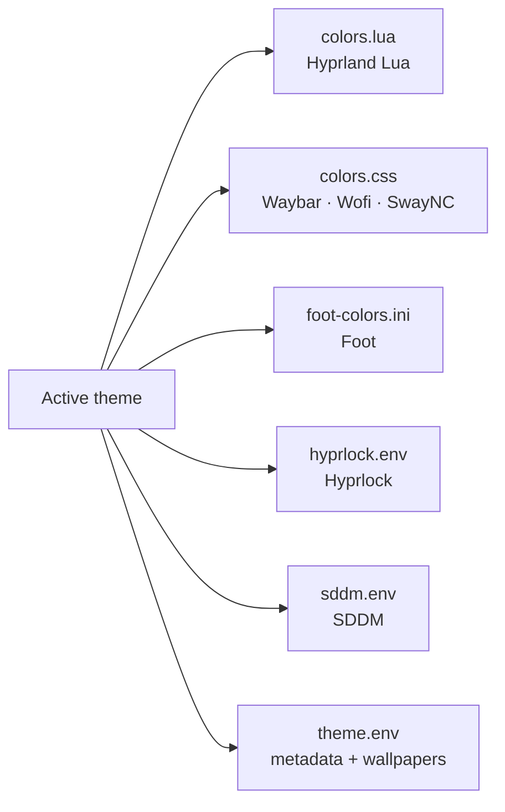
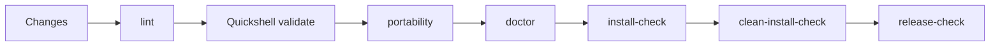
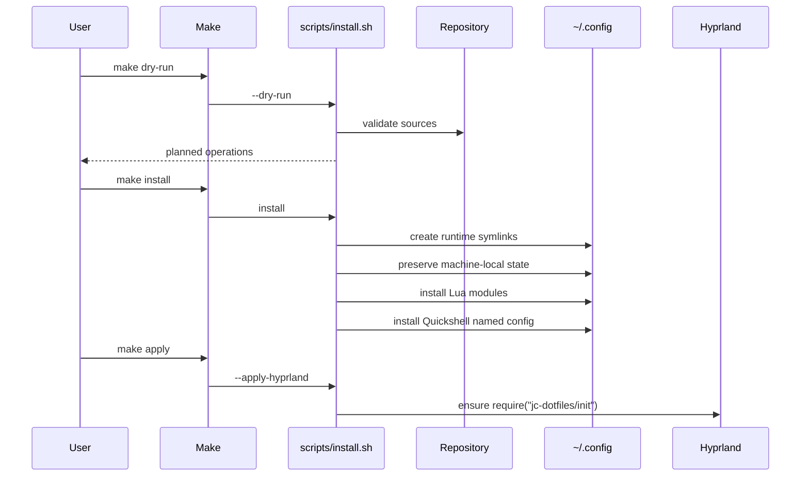

# Arquitectura

`jc-hyprland-dotfiles` está diseñado como un entorno Hyprland **modular,
portable, theme-driven y consciente del hardware**.

La arquitectura separa deliberadamente:

- configuración reutilizable,
- adaptadores de distribución,
- estado machine-local,
- runtime,
- temas,
- UI / Control Center,
- automatización y quality gates.

El objetivo es que un cambio de distribución, hardware, tema o implementación
visual no obligue a reescribir el resto del entorno.

---

# Principios de arquitectura

1. **Separación de responsabilidades**  
   Cada capa mantiene una responsabilidad pequeña y explícita.

2. **Portabilidad entre distribuciones**  
   Arch, Garuda y openSUSE se resuelven mediante adaptadores y no contaminan la
   configuración común.

3. **Portabilidad entre máquinas**  
   Seriales, conectores, layouts físicos y otros datos del host viven fuera de
   Git.

4. **Lua como única configuración soportada de Hyprland**  
   El proyecto está alineado con Hyprland `0.55+` y su modelo de configuración
   Lua. El host principal está validado actualmente con Hyprland `0.56.2`.

5. **Runtime desacoplado**  
   Waybar, keybindings y la UI consumen wrappers y servicios estables en lugar
   de depender directamente de comandos internos.

6. **Temas como contrato visual**  
   Los consumidores leen el tema activo mediante formatos específicos sin
   conocer qué tema fue seleccionado.

7. **Configuración segura y reversible**  
   La instalación preserva estado local y los cambios de monitores usan
   validación, Safe Apply, watchdog externo, backups y rollback.

8. **Observed ≠ Draft ≠ Applied ≠ Persistent**  
   El estado observado, la edición, el runtime confirmado y la persistencia son
   capas diferentes.

---

# Vista general


La idea central es que las capas compartidas no deben conocer identidad física
del host salvo a través de contratos machine-local explícitos.

---

# Capas del proyecto

## 1. Distribución

```text
distros/
├── arch/
├── garuda/
└── opensuse/
```

Responsabilidad:

- instalación de paquetes,
- package manager,
- integración específica de la distribución,
- preparación de dependencias.

No debe contener:

- seriales de monitor,
- layout físico,
- configuración visual común,
- estado local del usuario.

---

## 2. Perfiles

```text
profiles/
└── desktop/
    └── profile.env
```

Responsabilidad:

- definir el tipo lógico de estación,
- habilitar políticas reutilizables,
- servir como frontera para perfiles futuros.

Un perfil no contiene identidad de hardware de una máquina concreta.

---

## 3. Configuración reutilizable

```text
config/
├── foot/
├── hypr/
│   └── lua/
├── hypridle/
├── hyprlock/
├── quickshell/
├── sddm/
├── swaync/
├── systemd/
├── waybar/
└── wofi/
```

Regla:

> `config/` no debe contener seriales machine-local, conectores específicos del
> host, rutas `/home/<user>` ni otra identidad privada de la máquina.

---

## 4. Estado machine-local

La identidad física del host vive fuera del checkout:

```text
~/.config/jc-hyprland-dotfiles/local/
├── host.env
├── monitors.lua
├── backups/
│   └── displays/
└── wallpaper.env
```

### `host.env`

Responsabilidad:

- rol lógico de outputs,
- ownership de workspaces,
- perfil,
- hardware opcional necesario para runtime helpers.

### `monitors.lua`

Es la **única fuente persistente de configuración de displays**.

Contiene bloques Lua de Hyprland como:

```lua
hl.monitor({
    output = "desc:<hardware-description>",
    mode = "<width>x<height>@<refresh>",
    position = "<x>x<y>",
    scale = 1,
    transform = 0,
    disabled = false,
    vrr = 2,
})
```

También puede contener reglas machine-local relacionadas, por ejemplo
`hl.workspace_rule(...)`.

`monitors.lua` permanece fuera de Git porque puede contener descriptores o
seriales físicos del host.

### `wallpaper.env`

Responsabilidad:

- overrides locales,
- rotación,
- intervalos,
- target de wallpaper.

---

# Hyprland Lua-only

El runtime soportado utiliza Lua.

```text
~/.config/hypr/hyprland.lua
        │
        └── require("jc-dotfiles/init")
                         │
                         ├── theme.lua
                         ├── appearance.lua
                         ├── gaming.lua
                         ├── animations.lua
                         ├── autostart.lua
                         ├── local/monitors.lua
                         └── keybindings.lua
```

La integración de `jc-hyprland-dotfiles` se mantiene al final del archivo base de
la distribución para que el proyecto pueda aplicar overrides sin mantener un
fork completo de `hyprland.lua`.

El repositorio activo contiene únicamente:

```text
config/hypr/
└── lua/
    ├── animations.lua
    ├── appearance.lua
    ├── autostart.lua
    ├── gaming.lua
    ├── init.lua
    ├── keybindings.lua
    ├── README.md
    └── theme.lua
```

El camino de configuración pre-Lua fue retirado después de validar
end-to-end la persistencia con `local/monitors.lua`.

---

# Runtime namespace

El checkout del repositorio no es una API para los consumidores del escritorio.
El instalador expone un namespace estable:

```text
~/.config/jc-hyprland-dotfiles/
├── repo -> /path/to/jc-hyprland-dotfiles
├── theme -> /path/to/repo/themes/<active-theme>
│
├── bin/
│   ├── amd-gpu.sh
│   ├── apply-wallpaper.sh
│   ├── jc-control-center
│   ├── jc-displaycfg
│   ├── jc-displayctl
│   ├── jc-theme
│   ├── launch-foot.sh
│   ├── launch-wofi.sh
│   ├── lock-session.sh
│   ├── network-traffic.sh
│   ├── rotate-wallpaper.sh
│   ├── start-quickshell.sh
│   ├── start-swaync.sh
│   ├── start-waybar.sh
│   ├── suspend-session.sh
│   └── wallpaper-manager.sh
│
└── local/
    ├── host.env
    ├── monitors.lua
    ├── backups/
    │   └── displays/
    └── wallpaper.env
```

Los wrappers actúan como API de runtime y permiten cambiar implementaciones sin
modificar consumidores como Waybar o Quickshell.

---

# Arquitectura de temas

```text
themes/
├── cyber-noir/
└── odyssey-glass/
```

Cada tema implementa un contrato común:

```text
theme.env
colors.conf
colors.css
colors.lua
foot-colors.ini
hyprlock.env
sddm.env
wallpapers/
```

El tema activo se expone mediante:

```text
~/.config/jc-hyprland-dotfiles/theme
```

Consumidores principales:



`colors.conf` puede mantenerse como export legacy de paleta si algún consumidor
externo lo requiere, pero no forma parte del runtime soportado de Hyprland.

---

# Quickshell Control Center

Quickshell es el plano visual de control. La UI no ejecuta directamente comandos
de configuración de monitores.

```text
Waybar / keybind
      │
      ▼
jc-control-center
      │
      ▼
Quickshell IPC
      │
      ▼
Main.qml
      │
      └── DisplayPopup
              │
              ├── DisplayLayout / DisplayLayoutEditor
              ├── DisplayCard
              ├── DisplayDraftStore
              ├── MonitorModeParser
              ├── MonitorService
              └── MonitorApplyService
```

## `MonitorService.qml`

Responsabilidad:

- discovery,
- estado observado,
- normalización,
- geometría lógica,
- output enfocado,
- outputs deshabilitados,
- `availableModes`.

No realiza persistencia.

## `DisplayDraftStore.qml`

Responsabilidad:

- edición temporal,
- dirty tracking,
- Enable / Disable draft,
- topología proyectada,
- validación de overlap,
- posición relativa.

## `MonitorModeParser.qml`

Responsabilidad:

- agrupar modos reportados,
- resolver resolución y refresh,
- evitar combinaciones inexistentes,
- preservar modos cercanos distintos.

## `MonitorApplyService.qml`

Orquesta el runtime backend:

```text
QML
 ↓
jc-displayctl
 ↓
hyprctl eval hl.monitor(...)
```

La UI no contiene comandos `hyprctl`.

---

# Modelo de estado de displays

La separación vigente es:

```text
Observed State
      │
      ▼
Draft State
      │
      ▼
Applied Runtime State
      │
      ▼
Persistent State
```

## Observed

Lo que Hyprland reporta actualmente.

Fuente:

```text
MonitorService
hyprctl -j monitors all
```

## Draft

Lo que el usuario está editando.

Fuente:

```text
DisplayDraftStore
```

## Applied Runtime

Cambios enviados al compositor y confirmados con `Keep`.

Fuente de mutación:

```text
jc-displayctl
```

No implica persistencia.

## Persistent

Configuración que debe sobrevivir a `hyprctl reload`, logout o reboot.

Fuente:

```text
~/.config/jc-hyprland-dotfiles/local/monitors.lua
```

Writer:

```text
jc-displaycfg
```

---

# Runtime apply

`jc-displayctl` es el backend de mutación de monitores.

Responsabilidades:

- validar el output contra `hyprctl -j monitors all`,
- aplicar mode / position / scale / transform,
- aplicar Enable / Disable,
- preservar extras persistentes relevantes,
- impedir deshabilitar el último monitor activo,
- impedir deshabilitar el monitor enfocado,
- snapshot del estado anterior,
- Safe Apply,
- Keep,
- rollback manual,
- rollback automático.

## Safe Apply

```text
Draft
  │
  ▼
jc-displayctl safe-apply
  │
  ├── apply temporary runtime state
  ├── persist rollback transaction in XDG_RUNTIME_DIR
  └── systemd-run --user watchdog
             │
             └── timeout → rollback
```

El watchdog es externo a Quickshell. Cerrar o matar la UI no elimina la garantía
de rollback.

---

# Persistencia

`jc-displaycfg` mantiene la configuración persistente global de displays.

Comandos:

```bash
jc-displaycfg status
jc-displaycfg preview
jc-displaycfg save
jc-displaycfg backups
jc-displaycfg restore-last
```

La persistencia es **global**, no por tarjeta de monitor.

Motivo:

- `hyprctl reload` recarga la configuración completa;
- persistir únicamente un monitor podría revertir otro cambio runtime confirmado;
- el snapshot global mantiene runtime y persistencia reconciliados.

## Save transaction

```text
save
 │
 ├── require clean configerrors
 ├── snapshot `hyprctl -j monitors all`
 ├── parse monitor blocks from local/monitors.lua
 ├── build candidate
 ├── preserve non-monitor Lua
 ├── preserve persistent extras
 ├── backup current monitors.lua
 ├── same-directory atomic replace
 ├── hyprctl reload
 ├── wait for runtime convergence
 ├── verify runtime against pre-save snapshot
 └── success
```

Si falla reload, aparecen config errors o el runtime no converge al estado
confirmado:

```text
failure
   │
   ├── restore backup atomically
   ├── hyprctl reload
   └── return error
```

Backups:

```text
~/.config/jc-hyprland-dotfiles/local/backups/displays/
```

Lua permite persistir `disabled = true` junto con mode, position y scale, por lo
que la geometría reusable no se pierde al deshabilitar un output.

---

# Geometría lógica

Hyprland posiciona monitores en un espacio lógico 2D.

Para un monitor sin rotación:

```text
logicalWidth  = width  / scale
logicalHeight = height / scale
```

Las rotaciones de 90°/270° intercambian los ejes lógicos.

El Control Center:

- calcula topología proyectada,
- permite posiciones negativas,
- detecta overlap,
- permite touching edges,
- ofrece snapping,
- ofrece Left / Right / Above / Below,
- bloquea Safe Apply mientras el layout proyectado sea inválido.

---

# Enable / Disable

Las salidas deshabilitadas siguen siendo descubribles mediante:

```bash
hyprctl -j monitors all
```

Reglas de seguridad:

```text
✓ nunca deshabilitar el último monitor activo
✓ nunca deshabilitar el monitor enfocado
✓ repetir guards en UI y backend
✓ mantener la tarjeta del monitor deshabilitado
✓ rollback restaura geometría y enabled state
✓ re-enable usa disabled = false explícitamente
```

Waybar ya fue validado durante hotplug lógico causado por Enable / Disable; sus
workspaces se reacomodan sin acoplar un restart artificial al backend de displays.

---

# Wallpaper architecture

El subsistema de wallpaper permanece independiente del de displays.

```text
Theme / wallpaper.env
          │
          ▼
 wallpaper-manager.sh
          │
     ┌────┴────┐
     ▼         ▼
   Awww     Hyprpaper
 preferred    fallback
```

Un cambio de monitor no reinicia arbitrariamente el wallpaper backend.

---

# Quality architecture

La configuración se trata como código.



Los gates incluyen:

```text
bash -n
ShellCheck
fish -n
JSON / JSONC validation
theme validation
Quickshell structural contracts
display runtime safety contracts
display persistence contracts
portability check
doctor
Hyprland configerrors
runtime symlink integrity
clean-install simulation
git diff --check
```

---

# Flujo de instalación



---

# Reglas de dependencia

Debe mantenerse:

```text
UI
↓
service contracts
↓
runtime wrappers
↓
Hyprland APIs
```

No debe ocurrir:

```text
theme → serial machine-local
UI → hyprctl directo
Waybar → detalles internos de QML
distro adapter → configuración visual común
shared config → /home/<user>
display apply → wallpaper restart
```

---

# Estado de implementación

```text
Phase 1A    read-only display foundation                    ✓
Phase 1B.1  draft editing                                   ✓
Phase 1B.2  runtime mode apply                              ✓
Phase 1B.3  Safe Apply / Keep / external rollback           ✓
Phase 1B.4  scale / orientation                             ✓
Phase 1B.5  visual topology / position editor               ✓
Phase 1B.6  safe monitor Enable / Disable                   ✓
Phase 1C.1  atomic persistent monitors.lua backend          ✓
Phase 1C.2  retire pre-Lua compatibility path               ✓
Phase 1C.3  Quickshell Save Configuration orchestration     next
```

Portabilidad:

```text
Garuda Linux            validated
Arch Linux              adapter available
openSUSE Tumbleweed     adapter available
```

---

# Regla principal

La arquitectura debe permitir cambiar de forma independiente:

```text
distribution
hardware
theme
Hyprland release
runtime implementation
visual Control Center
```

La máquina define **qué hardware tiene**.

Hyprland reporta **cómo está funcionando**.

Los roles definen **qué función cumple**.

La UI define **qué se está editando**.

El runtime backend define **qué se aplica temporalmente**.

La persistencia define **qué debe sobrevivir a un reload/reboot**.
