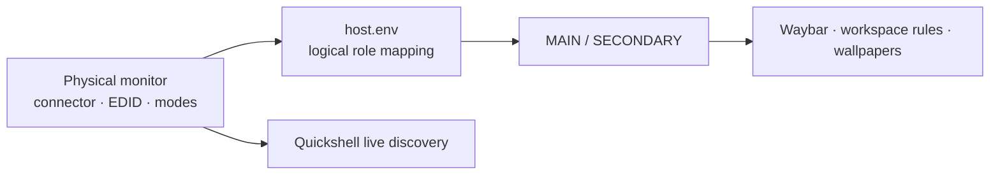
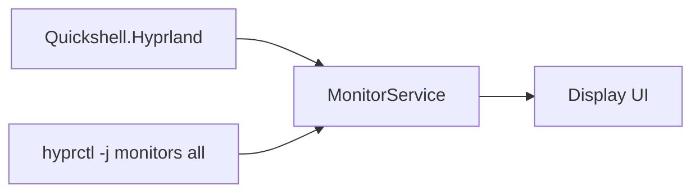
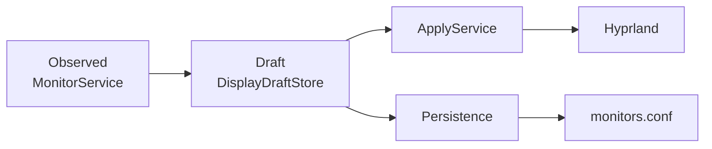

# Multi-monitor

El soporte multi-monitor de `jc-hyprland-dotfiles` está diseñado alrededor de
**roles lógicos**, discovery dinámico y estado machine-local.

El objetivo es evitar que temas, Waybar, Quickshell o scripts compartidos dependan
de conectores, seriales o modelos físicos específicos.

---

# Principio principal

El runtime usa roles:

```text
MAIN_OUTPUT
SECONDARY_OUTPUT
```

y no nombres físicos hardcodeados dentro de temas o configuración compartida.

Ejemplo machine-local:

```bash
MAIN_OUTPUT=DP-3
SECONDARY_OUTPUT=DP-1
```

Estos valores viven en:

```text
~/.config/jc-hyprland-dotfiles/local/host.env
```

El ejemplo anterior es únicamente ilustrativo; cada host mantiene sus propios
outputs.

---

# Separación entre rol y hardware



Hay dos fuentes de información con responsabilidades diferentes:

## Configuración machine-local

Define **qué función lógica** tiene cada monitor.

```text
MAIN_OUTPUT
SECONDARY_OUTPUT
MAIN_WORKSPACES
SECONDARY_WORKSPACES
```

## Discovery runtime

Quickshell/Hyprland descubre **qué hardware existe y cómo está configurado en
este momento**.

Incluye:

```text
output
description
make
model
serial        runtime only
width
height
refreshRate
x
y
scale
transform
focused
disabled
activeWorkspace
availableModes
```

Los seriales pueden observarse en runtime, pero no deben publicarse ni
versionarse en documentación/config compartida.

---

# Estado persistente

La configuración real del host permanece fuera de Git:

```text
~/.config/jc-hyprland-dotfiles/local/
├── host.env
└── monitors.conf
```

## `host.env`

Define roles y workspace ownership.

Ejemplo:

```ini
PROFILE=desktop

MAIN_OUTPUT=<main-output>
SECONDARY_OUTPUT=<secondary-output>

MAIN_WORKSPACES=1,2,3,4,5
SECONDARY_WORKSPACES=6,7,8,9,10
```

## `monitors.conf`

Define la configuración persistente específica del host.

Esta separación permite cambiar:

- monitor físico,
- conector,
- GPU,
- docking,
- resolución,

sin modificar temas ni módulos compartidos.

---

# Geometría de Hyprland

Hyprland posiciona monitores dentro de un espacio lógico 2D.

Conceptualmente:

```text
(x, y)
  │
  ▼
┌───────────────────┐
│      monitor      │
│                   │
│ logical W × H     │
└───────────────────┘
```

La geometría lógica depende de:

```text
physical resolution
        │
        ▼
      scale
        │
        ▼
    transform
        │
        ▼
logical width / height
```

Para una pantalla sin rotación:

```text
logicalWidth  = width  / scale
logicalHeight = height / scale
```

Cuando el transform intercambia ejes —por ejemplo rotaciones de 90° o 270°— el
ancho y alto lógicos se intercambian.

---

# Topología

Dos monitores pueden organizarse, por ejemplo:

```text
             ┌─────────────────────┐
             │      SECONDARY      │
             │                     │
             └─────────────────────┘
┌─────────────────────────────────────────┐
│                  MAIN                   │
│                                         │
└─────────────────────────────────────────┘
```

Pero esta topología no se codifica como dibujo estático.

`DisplayLayout.qml` calcula la representación a partir de:

```text
x
y
logicalWidth
logicalHeight
```

obtenidos del estado observado.

---

# Quickshell MonitorService

Ruta:

```text
config/quickshell/jc-hyprland/services/MonitorService.qml
```

Responsabilidad:

- discovery,
- normalización,
- estado observado,
- geometría lógica,
- modos disponibles,
- monitor enfocado.

Arquitectura:



La combinación es deliberada:

- `Quickshell.Hyprland` aporta estado live e integración IPC.
- `hyprctl -j monitors all` aporta una vista detallada incluyendo
  `availableModes`.

---

# Modos de monitor

Los modos no se hardcodean.

Ejemplo de dato runtime:

```text
3440x1440@165.00Hz
3440x1440@120.00Hz
3440x1440@99.98Hz
3440x1440@59.97Hz
```

Otro monitor puede reportar:

```text
5120x2160@179.99Hz
5120x2160@120.00Hz
5120x2160@59.98Hz
3840x2160@179.98Hz
...
```

El Control Center debe usar exclusivamente lo que el monitor reporta como
disponible.

---

# Resolución y refresh rate no son independientes

La selección futura seguirá:

```text
availableModes
      │
      ▼
MonitorModeParser
      │
      ├── resolutions
      │
      └── refresh rates per resolution
```

Si una resolución reporta:

```text
2560x1440@180.00Hz
2560x1440@120.00Hz
2560x1440@59.95Hz
```

el selector de refresh rate solo debe ofrecer esos valores para esa resolución.

No debe permitirse construir arbitrariamente una combinación que el monitor no
haya anunciado.

---

# Duplicados y valores cercanos

Algunos EDID/modes pueden contener entradas repetidas.

Ejemplo:

```text
1920x1080@60.00Hz
1920x1080@60.00Hz
```

Los duplicados exactos pueden deduplicarse.

En cambio:

```text
1920x1080@120.00Hz
1920x1080@119.88Hz
```

son modos distintos y deben conservarse como tales.

La lógica de parseo debe vivir fuera de los componentes visuales.

---

# Estado observado, draft y aplicado

La edición futura no modificará directamente `MonitorService`.



## Observed

Representa lo que Hyprland está usando.

## Draft

Representa lo que el usuario está editando.

## Applied

Representa los cambios enviados al runtime.

Esto permite:

- Cancel,
- Reset,
- dirty tracking,
- validación,
- preview,
- rollback.

---

# Runtime Apply vs Save permanently

Son operaciones separadas.

## Apply

Modifica el runtime de Hyprland.

Objetivo futuro:

```text
ApplyService
    ↓
hyprctl
```

## Save permanently

Actualiza:

```text
~/.config/jc-hyprland-dotfiles/local/monitors.conf
```

Un cambio temporal no debe persistirse automáticamente.

---

# Safe apply

Cambiar configuración de pantallas tiene riesgo de producir:

- pantalla negra,
- modo no útil,
- layout fuera de alcance,
- combinación no deseada.

Por eso el roadmap contempla:

```text
Apply draft
    │
    ▼
temporary runtime state
    │
    ▼
confirmation countdown
    │
    ├── Keep changes
    │
    └── Rollback
```

El rollback debe restaurar el estado observado anterior.

---

# Waybar

Waybar sigue usando roles machine-local.

La configuración se renderiza para dos instancias independientes:

```text
MAIN_OUTPUT
    └── main Waybar

SECONDARY_OUTPUT
    └── secondary Waybar
```

El runtime de Waybar no necesita conocer EDID ni seriales.

---

# Workspaces

La asociación lógica puede mantenerse en `host.env`:

```ini
MAIN_WORKSPACES=1,2,3,4,5
SECONDARY_WORKSPACES=6,7,8,9,10
```

La intención es que el mismo esquema sobreviva a un cambio físico de monitor
si el nuevo monitor recibe el mismo rol lógico.

---

# Wallpapers

Los wallpapers también usan roles:

```text
main
secondary
both
```

El backend de wallpaper no debe depender directamente del nombre físico de un
monitor en archivos de tema.

La traducción entre rol lógico y output real pertenece al runtime.

---

# Control Center — fases

## Phase 1A

Estado actual:

```text
✓ monitor discovery
✓ availableModes
✓ focused output
✓ topology
✓ display cards
✓ read-only UI
✓ IPC
✓ runtime wrapper
✓ quality gates
```

No modifica monitores.

## Phase 1B

Planeado:

```text
DisplayDraftStore
MonitorModeParser
ResolutionSelector
RefreshRateSelector
ScaleSelector
OrientationSelector
ApplyService
Safe Apply
Rollback
```

## Phase 1C

Planeado:

```text
persistent monitors.conf writer
validation
runtime + persistence reconciliation
```

## Phase 1D

Planeado:

```text
Waybar Control Center button
Hyprland keybind
startup integration
```

---

# Portabilidad

La configuración multi-monitor debe seguir estas reglas:

```text
DO
✓ guardar roles en host.env
✓ guardar configuración física en monitors.conf
✓ descubrir modos en runtime
✓ usar geometría lógica
✓ usar wrappers/services

DON'T
✗ guardar seriales en Git
✗ meter conectores en themes
✗ hardcodear resoluciones en QML
✗ hacer que UI ejecute comandos directamente
✗ asumir que todos los hosts tienen dos monitores idénticos
```

---

# Diagnóstico

El estado observado puede inspeccionarse con:

```bash
hyprctl -j monitors all
```

El doctor del proyecto valida que los outputs configurados como roles estén
activos cuando corresponde.

Para Quickshell:

```bash
~/.config/jc-hyprland-dotfiles/bin/jc-control-center ipc-show
```

Y para abrir el módulo de displays:

```bash
~/.config/jc-hyprland-dotfiles/bin/jc-control-center show
```

---

# Regla principal

La configuración compartida debe poder sobrevivir a:

```text
cambio de monitor
cambio de conector
cambio de resolución
cambio de distro
cambio de tema
```

sin obligar a reescribir componentes reutilizables.

La máquina define **qué hardware tiene**.

El runtime descubre **cómo está funcionando**.

Los roles definen **qué función cumple**.

La UI presenta **qué puede cambiarse**.

Y la persistencia decide **qué debe conservarse**.
